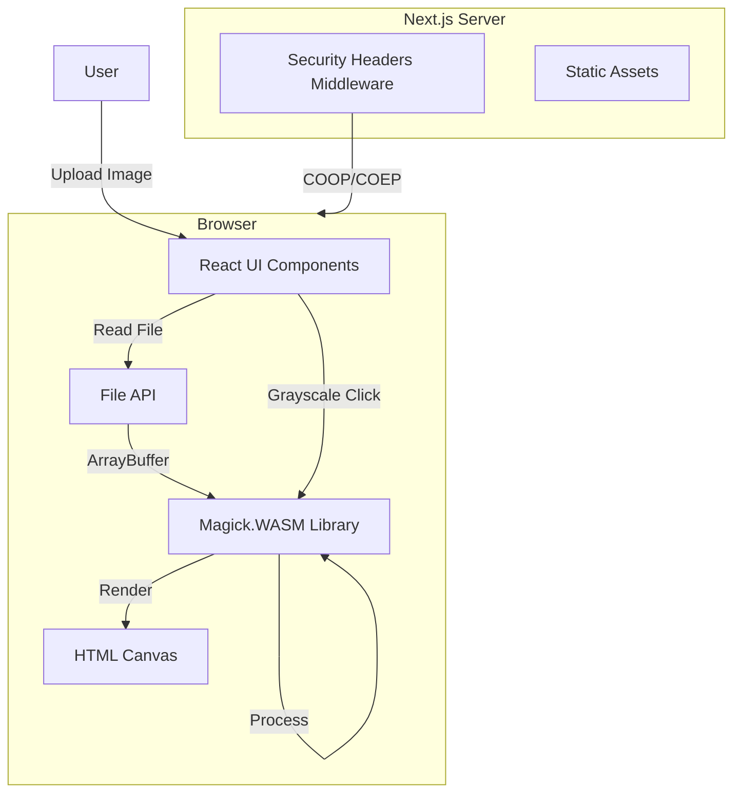

# Design Document: Magick.WASM Grayscale POC

## Overview

This design describes a Next.js 14 (App Router) web application that demonstrates client-side image processing using ImageMagick WASM. The application provides a minimal interface for uploading images, displaying them on a canvas, and converting them to grayscale—proving the WASM engine works correctly in the browser.

The key technical challenge is configuring the browser environment to support `SharedArrayBuffer`, which Magick.WASM requires for multi-threaded operations.

## Architecture



### Key Architecture Decisions

1. **Client-Side Only Processing**: All image manipulation happens in the browser via WASM. No server-side image processing.

2. **Security Headers via next.config.js**: The `Cross-Origin-Opener-Policy` and `Cross-Origin-Embedder-Policy` headers are configured at the Next.js level to enable `SharedArrayBuffer`.

3. **Single Page Application**: The entire POC lives on a single page (`app/page.tsx`) with a client component for interactivity.

4. **Canvas-Based Rendering**: Images are rendered to an HTML canvas element, which Magick.WASM can write to directly.

## Components and Interfaces

### Component Hierarchy

```
app/
├── layout.tsx          # Root layout with metadata
├── page.tsx            # Server component wrapper
└── components/
    └── ImageProcessor.tsx  # Client component with all logic
```

### ImageProcessor Component

The main client component that handles:
- File upload input
- WASM initialization
- Image display on canvas
- Grayscale conversion
- Loading/error states

```typescript
interface ImageProcessorState {
  isInitialized: boolean;
  isProcessing: boolean;
  error: string | null;
  hasImage: boolean;
}
```

### Key Functions

| Function | Purpose |
|----------|---------|
| `initializeMagick()` | Loads and initializes the Magick.WASM library |
| `handleFileUpload(file: File)` | Validates and reads the uploaded image file |
| `renderImageToCanvas(data: Uint8Array)` | Displays image data on the canvas element |
| `convertToGrayscale()` | Applies grayscale transformation using Magick.WASM |
| `validateImageFile(file: File)` | Checks if file is a valid image type |

## Data Models

### File Validation

```typescript
const ACCEPTED_IMAGE_TYPES = ['image/png', 'image/jpeg', 'image/gif', 'image/webp'];

interface FileValidationResult {
  isValid: boolean;
  error?: string;
}
```

### Processing State

```typescript
type ProcessingStatus = 'idle' | 'initializing' | 'processing' | 'complete' | 'error';

interface ProcessingState {
  status: ProcessingStatus;
  errorMessage: string | null;
}
```

### Canvas Dimensions

```typescript
interface CanvasDimensions {
  width: number;
  height: number;
  aspectRatio: number;
}

const MAX_CANVAS_WIDTH = 800;
const MAX_CANVAS_HEIGHT = 600;
```

## Correctness Properties

*A property is a characteristic or behavior that should hold true across all valid executions of a system—essentially, a formal statement about what the system should do. Properties serve as the bridge between human-readable specifications and machine-verifiable correctness guarantees.*

### Property 1: Security Headers Present on All Responses
*For any* HTTP response from the server, the response headers SHALL include both `Cross-Origin-Opener-Policy: same-origin` and `Cross-Origin-Embedder-Policy: require-corp`.
**Validates: Requirements 1.2, 1.3**

### Property 2: Non-Image File Rejection
*For any* file with a MIME type not in the accepted image types list (PNG, JPEG, GIF, WebP), the system SHALL reject the file and the application state SHALL remain unchanged.
**Validates: Requirements 2.3**

### Property 3: Aspect Ratio Preservation
*For any* image with dimensions (width, height), when rendered to the canvas, the ratio of displayed width to displayed height SHALL equal the original width/height ratio (within floating-point tolerance).
**Validates: Requirements 3.3**

### Property 4: Control State Matches Processing State
*For any* application state, interactive controls (file input, grayscale button) SHALL be disabled if and only if `isProcessing` is true.
**Validates: Requirements 5.2, 5.3**

### Property 5: Error State Displays Message
*For any* application state where `error` is non-null, the UI SHALL display the error message to the user.
**Validates: Requirements 5.4**

## Error Handling

| Error Scenario | User Message | Recovery Action |
|----------------|--------------|-----------------|
| WASM initialization failure | "Failed to initialize image processor. Please refresh the page." | Retry on page refresh |
| Invalid file type | "Please select a valid image file (PNG, JPEG, GIF, or WebP)." | Allow new file selection |
| File read failure | "Failed to read the selected file. Please try again." | Allow new file selection |
| Grayscale conversion failure | "Failed to convert image. Please try again." | Preserve original image, allow retry |

### Error State Management

```typescript
const handleError = (error: Error, context: string) => {
  console.error(`[${context}]`, error);
  setState(prev => ({
    ...prev,
    isProcessing: false,
    error: getErrorMessage(context)
  }));
};
```

## Testing Strategy

### Unit Tests
Unit tests will verify specific behaviors and edge cases:

- File validation correctly identifies valid/invalid MIME types
- Canvas dimension calculations maintain aspect ratio
- Error messages are correctly mapped to error contexts
- State transitions occur correctly

### Property-Based Tests
Property-based tests will use **fast-check** library to verify universal properties:

- **Property 1**: Generate random HTTP requests and verify headers are present
- **Property 2**: Generate files with random non-image MIME types and verify rejection
- **Property 3**: Generate random image dimensions and verify aspect ratio is preserved after scaling
- **Property 4**: Generate random processing states and verify control disabled state matches
- **Property 5**: Generate random error states and verify message display

Each property-based test will run a minimum of 100 iterations and be tagged with the format:
`**Feature: magick-wasm-grayscale, Property {number}: {property_text}**`

### Test File Structure

```
__tests__/
├── ImageProcessor.test.tsx    # Unit tests for component
├── validation.test.ts         # Unit tests for file validation
├── properties/
│   └── imageProcessor.property.test.ts  # Property-based tests
```

### Testing Tools
- **Jest**: Test runner and assertion library
- **React Testing Library**: Component testing
- **fast-check**: Property-based testing library
