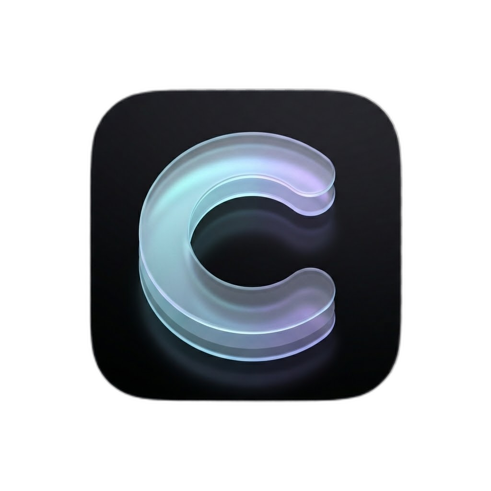

# Conjure

<p align="center">
  
</p>

<p align="center">
  <strong>AI-powered image editor that runs entirely in your browser.</strong><br/>
  No uploads. No servers. Just ImageMagick WebAssembly and generative UI.
</p>

<p align="center">
  <a href="https://conjure.henilbuilds.tech"></a>
  <a href="https://github.com/henilptel/Conjure/actions"></a>
  
  
  
</p>

---

A client-side image processing application with AI-powered Generative UI, built with Next.js and ImageMagick WebAssembly. All image processing happens locally in the browser—no server uploads, just pure client-side performance with intelligent AI-generated controls.

## Why This Exists

Most web-based image editors either upload your files to a server or rely on limited browser APIs. This project takes a different approach: it compiles ImageMagick—the industry-standard image processing library—to WebAssembly and runs it entirely in your browser. Your images never leave your machine.

The AI assistant doesn't just answer questions - it generates the exact UI controls you need based on natural language requests.

## Features

### Generative UI
- **AI-Generated Controls**: Ask for an effect and the AI summons the appropriate sliders to the HUD panel
- **Tool Calling**: Uses Vercel AI SDK v5 tool calling to dynamically render UI components
- **Initial Values**: AI can set starting values when creating controls (e.g., "add a strong blur" starts at higher intensity)
- **Dynamic Dock**: Floating dock with tool browser, active tools panel, and chat history
- **Smooth Animations**: Framer Motion powers panel entry/exit animations

### Image Processing (15 Effects)
- **Client-Side Processing**: All operations run locally using WebAssembly
- **Comprehensive Effects Suite**:
  - **Color & Light**: Brightness, Saturation, Hue, Invert
  - **Detail & Texture**: Blur, Sharpen, Charcoal, Edge Detect, Grayscale
  - **Artistic**: Sepia, Contrast, Solarize, Vignette
  - **Geometry & Distortion**: Rotate, Wave
- **Non-Destructive Pipeline**: Effects apply to the original source image through a unified pipeline
- **Deterministic Effect Order**: Effects always apply in a consistent order for predictable results
- **Real-Time Preview**: CSS filter preview during slider drag; WASM processing fires on pointer release for responsive, non-blocking edits
- **Aspect Ratio Preservation**: Images scale to fit canvas while maintaining proportions
- **File Validation**: Supports PNG, JPEG, GIF, and WebP formats

### Editing Controls
- **Compare Mode**: Hold Space to instantly preview the original image while editing
- **Undo/Redo**: Full history support with Ctrl+Z (undo) and Ctrl+Shift+Z (redo) keyboard shortcuts
- **UI Buttons**: Undo/redo buttons in the dock for mouse-based workflow

### AI Assistant
- **Context-Aware Chat**: The AI knows your current image state, active tools, and their values
- **Streaming Responses**: Real-time feedback as the AI generates responses
- **Groq-Powered**: Uses Llama-3.3-70b-versatile for fast, accurate responses

### Privacy & Performance
- **Zero Image Uploads**: Your images never leave your browser
- **Local Processing**: All ImageMagick operations run in WebAssembly
- **Minimal API Calls**: Only chat messages are sent to the cloud (via Groq)

## Technical Architecture

### Core Libraries

- **Next.js 16** with App Router
- **React 19** with latest features
- **@imagemagick/magick-wasm** for client-side image processing
- **Vercel AI SDK v5** with `useChat`, `streamText`, and tool calling
- **Groq API** with Llama-3.3-70b-versatile model
- **Zustand** for global state management
- **Framer Motion** for animations
- **TypeScript** for type safety
- **Tailwind CSS v4** for styling
- **Lucide React** for icons

### Key Design Decisions

**SharedArrayBuffer Configuration**: HTTP headers (`Cross-Origin-Opener-Policy` and `Cross-Origin-Embedder-Policy`) enable SharedArrayBuffer for optimal WebAssembly performance.

**AI SDK v5 Patterns**:
- `useChat` from `@ai-sdk/react` with `DefaultChatTransport`
- `UIMessage` with `parts` array instead of `content` string
- `sendMessage()` with dynamic body for image context
- `toUIMessageStreamResponse()` for streaming

**Tool Calling Architecture**:
- `show_tools` tool defined with Zod schema
- Tools array with optional `initial_value` support
- Client-side tool call detection via `isToolUIPart` helper
- Bounded FIFO cache prevents duplicate tool callbacks

**Tool Registry Pattern**:
- Centralized `TOOL_REGISTRY` follows Open-Closed Principle
- Each tool defines: id, label, min/max, defaultValue, icon, and execute function
- `EFFECT_ORDER` array ensures deterministic processing order
- Adding new tools requires only a registry entry—no pipeline changes

**State Management**:
- Zustand store manages global app state (image, tools, processing)
- Shallow equality selectors prevent unnecessary re-renders
- Actions for tool add/update/remove operations

**Modular Architecture**:
- `lib/magick.ts` - WebAssembly initialization and image operations
- `lib/canvas.ts` - Canvas rendering with aspect ratio calculations
- `lib/validation.ts` - File type validation
- `lib/chat.ts` - Chat utilities and system message builder
- `lib/types.ts` - Shared types and tool state functions
- `lib/tools-registry.ts` - Centralized tool definitions
- `lib/tools-definitions.ts` - Effect order and tool executors
- `lib/store.ts` - Zustand global state store
- `lib/hooks.ts` - Custom React hooks
- `lib/memory-management.ts` - Memory optimization utilities
- `app/components/ImageProcessor.tsx` - Main UI with unified effects pipeline
- `app/components/dock/` - Dynamic dock UI components
- `app/components/overlay/ToolPanel.tsx` - Glassmorphism HUD panel
- `app/components/ui/Slider.tsx` - Reusable slider component
- `app/api/chat/route.ts` - API route with tool definitions

## Getting Started

### Prerequisites

You'll need a Groq API key for the chat feature. Get one free at [console.groq.com](https://console.groq.com).

### Installation

1. Install dependencies:

```bash
npm install
```

2. Set up environment variables:

```bash
cp .env.example .env.local
# Add your GROQ_API_KEY to .env.local
```

3. Run the development server:

```bash
npm run dev
```

4. Open [http://localhost:3000](http://localhost:3000)

## Testing

The project uses a dual testing approach with Jest and fast-check:

**Property-Based Testing** with fast-check validates universal properties across the codebase, including aspect ratio preservation, file validation, canvas constraints, effect processing, tool state management, and UI component behavior.

**Unit Testing** with Jest provides comprehensive coverage for specific scenarios including chat interactions, tool handling, keyboard shortcuts, undo/redo functionality, and component integration.

Run tests:

```bash
npm test
```

## Project Structure

```
├── app/
│   ├── api/chat/route.ts         # Groq API with show_tools tool
│   ├── components/
│   │   ├── ImageProcessor.tsx    # Main processor with effects pipeline
│   │   ├── LoadingIndicator.tsx  # Loading state component
│   │   ├── MemoryStats.tsx       # Memory usage display
│   │   ├── dock/
│   │   │   ├── ActiveToolsPanel.tsx  # Active tools display
│   │   │   ├── ChatHistory.tsx       # Chat message history
│   │   │   ├── DynamicDock.tsx       # Main dock container
│   │   │   ├── EffectsFAB.tsx        # Floating action button
│   │   │   ├── GhostToast.tsx        # Toast notifications
│   │   │   ├── ToolBrowser.tsx       # Tool selection browser
│   │   │   └── UndoRedoButtons.tsx   # Undo/redo controls
│   │   ├── overlay/
│   │   │   └── ToolPanel.tsx     # Glassmorphism HUD panel
│   │   └── ui/
│   │       └── Slider.tsx        # Reusable slider component
│   ├── contexts/
│   │   └── ChatContext.tsx       # Chat state context
│   ├── page.tsx                  # Home page with layered z-index layout
│   └── layout.tsx                # Root layout
├── lib/
│   ├── magick.ts                 # ImageMagick WASM wrapper
│   ├── canvas.ts                 # Canvas rendering utilities
│   ├── validation.ts             # File validation logic
│   ├── chat.ts                   # Chat utilities
│   ├── types.ts                  # Types and tool state functions
│   ├── tools-registry.ts         # Centralized tool definitions
│   ├── tools-definitions.ts      # Effect order and executors
│   ├── store.ts                  # Zustand global state
│   ├── hooks.ts                  # Custom React hooks
│   ├── memory-management.ts      # Memory optimization
│   ├── css-preview.ts            # CSS preview utilities
│   └── utils.ts                  # Utility functions
├── __tests__/
│   ├── properties/               # Property-based tests (25+ test files)
│   ├── chat.test.ts              # Chat utilities tests
│   └── tools-registry.test.ts    # Tool registry tests
└── public/
    └── magick.wasm               # ImageMagick WebAssembly binary
```

## How It Works

### Generative UI Flow

1. **User Request**: "Add a blur effect" or "Make it look vintage"
2. **Tool Calling**: The AI invokes `show_tools` with appropriate parameters
3. **Dynamic Dock**: Tool controls appear in the floating dock panel
4. **Initial Values**: AI can set starting values based on intent
5. **Real-Time Editing**: Adjust sliders to fine-tune the effect

### Image Processing Flow

1. **Initialization**: ImageMagick WASM binary loads on first image upload
2. **Image Loading**: File is read as Uint8Array and processed for RGBA pixel data
3. **Canvas Rendering**: Pixels render to canvas, scaled to fit 800×600px max
4. **Effects Pipeline**: All active tools process through a unified pipeline in deterministic order
5. **Instant Preview**: CSS filters apply during drag for instant feedback; WASM pipeline runs on pointer release

### Effect Processing Order

Effects are applied in a consistent order for predictable results:
1. Geometry (rotate)
2. Color adjustments (brightness, saturation, hue, invert)
3. Detail filters (blur, sharpen, charcoal, edge_detect, grayscale)
4. Artistic effects (sepia, contrast, solarize, vignette, wave)

### AI Chat Flow

1. **Context Injection**: Current image state (dimensions, active tools, values) sent with each message
2. **System Message**: API route builds context-aware system prompt
3. **Tool Detection**: Client monitors for `show_tools` tool calls in response parts
4. **State Update**: New tools added to activeTools via Zustand store

## Usage Examples

**Upload and Edit**:
1. Upload a PNG, JPEG, GIF, or WebP image
2. Ask: "Add a blur effect" → Blur slider appears in dock
3. Ask: "Make it sepia toned" → Sepia slider joins the panel
4. Adjust sliders to fine-tune

**Context-Aware Queries**:
- "What effects are currently active?"
- "What's my blur level set to?"
- "What are my image dimensions?"

**Natural Language Editing**:
- "Add a strong blur" → Blur slider at high value
- "Give me contrast control" → Contrast slider appears
- "Make it look vintage" → Sepia + vignette sliders added
- "I want to sharpen the details" → Sharpen slider added
- "Rotate it slightly" → Rotate slider appears

## Keyboard Shortcuts

| Shortcut | Action |
|----------|--------|
| Space (hold) | Compare mode - view original image |
| Ctrl+Z / Cmd+Z | Undo last action |
| Ctrl+Shift+Z / Cmd+Shift+Z | Redo action |

## Available Tools

| Tool | Range | Description |
|------|-------|-------------|
| Blur | 0-20 | Gaussian blur effect |
| Grayscale | 0-100 | Desaturation to black & white |
| Sepia | 0-100 | Warm vintage tone |
| Contrast | -100 to 100 | Increase/decrease contrast |
| Brightness | 0-200 | Light intensity (100 = neutral) |
| Saturation | 0-300 | Color intensity (100 = neutral) |
| Hue | 0-200 | Color shift (100 = neutral) |
| Invert | 0-1 | Toggle color inversion |
| Sharpen | 0-10 | Edge enhancement |
| Charcoal | 0-10 | Sketch-like effect |
| Edge Detect | 0-10 | Canny edge detection |
| Rotate | -180 to 180 | Image rotation in degrees |
| Wave | 0-100 | Wave distortion effect |
| Solarize | 0-100 | Partial color inversion |
| Vignette | 0-100 | Dark corner effect |

## Browser Compatibility

Requires WebAssembly and SharedArrayBuffer support:
- Chrome/Edge 92+
- Firefox 89+
- Safari 15.2+

## Development Roadmap

**Current Version: v1.1**

### Version History
The project evolved through iterative development: ImageMagick WASM integration (v0.1) → manual controls (v0.2) → Generative UI with 15 effects (v0.4) → dynamic dock + glassmorphism UI (v0.7–v0.9) → architecture overhaul with Zustand (v0.8) → undo/redo and compare mode (v1.0) → BufferPool & CI/CD (v1.1).

See [CHANGELOG.md](CHANGELOG.md) for full details.

### Planned Features
- Image export functionality
- Batch processing support
- Custom tool presets

---

## Contributing

Contributions are welcome! Please read [CONTRIBUTING.md](CONTRIBUTING.md) to get started.

## License

This project is licensed under the [MIT License](LICENSE).

## Code of Conduct

This project follows the [Contributor Covenant](CODE_OF_CONDUCT.md). By participating, you agree to uphold its standards.
